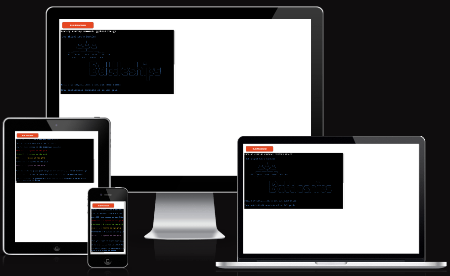
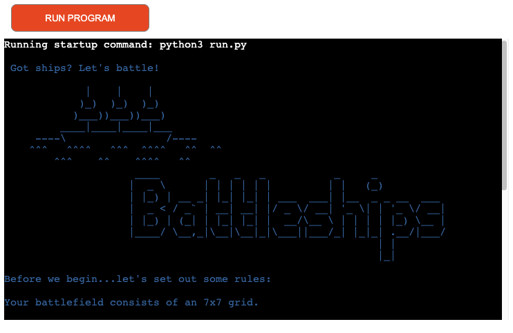
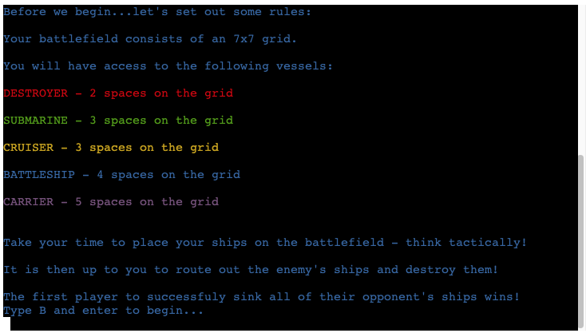
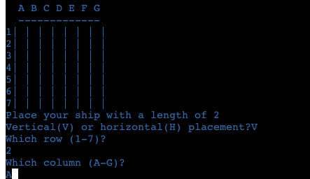

<h1 align="center"> :anchor: Battleships Game :anchor: </h1>

[View the live project here](https://nickdevc-battleships.herokuapp.com/)

Based on the popular, classic boardgame, Battleships is a Python terminal game running on Heroku. It provides 4x overlapping fields of play, allowing the user to place their ships and also target those of the computer. The user manually selects their ship placements, whilst the computer is randomly assigned coordinates. The game is won when all 5 of the opponent's ships have been destroyed!

## Index - Table of Contents
*  [Scope](#scope)
*  [Features](#features)
*  [Design](#design)
*  [Technologies Used](#technologies-used)
*  [Testing](#testing)
*  [Deployment](#deployment)
*  [Credits](#credits)

## Scope

-  ### Initial plan
   

## Features

   ### Existing/current Features
      
-   __Welcome Screen__

    - 

      

-   __Rules__

    - A 

      
      
-   __Player Placement__

    - 

      
      
-   __Player/computer Guesses__

    - 

      

-   __Visual feedback__

    - 

      

   ### Potential Future Features
   
- User name input
   - This would add a personal touch to the game and allow for further feedback throughout the playtime ie. messages throughout the game could include direct reference to the user.
- APIs
   - Using Google Cloud APIs, I could store the user's name into a database.
   - I could then ensure unique usernames are used and check against returning players, displaying previous scores before playing. This could potentially add an additional competitive element.
- A visual leaderboard
   - With the use of APIs, I could create a 'Top 5' leaderboard to be displayed at the start of the game. This could be measured with 'least amounts of guesses'.

## Design

   ### Colour
- 

   
   

## Technologies and Support

### Languages Used

-   [Python](https://en.wikipedia.org/wiki/python)

### Frameworks, Libraries, Programs, and Websites

-   ['Time' module](https://docs.python.org/3/library/time.html)
      - Used to support my understanding of the time module and ultimately lead to the inclusion of time delays on various 'print' messages throughout the game, leading to more comfortabel user experience.
      
-   ['Sys' module](https://docs.python.org/3/library/sys.html)
      - Used to support my understanding of the sys module which resulted in the 'typewriter' style animation attached to various 'print' statements. This was an aesthetic addition that helped slow down the pace of the game and a better user experience.

-   ['Random' module](https://docs.python.org/3/library/random.html)
      - This module was needed to incorporate the 'randint' method of returning random integers for the computer's ship placement.
      
-   [ASCII Art Library](https://pypi.org/project/art/)
      - This website helped familiarise myself with ASCII art and lead to me finding the 'Battleships' welcome text and my own devleopment of the 'ship' image (also on the welcome screen)

-   [Randint method(w3schools)](https://www.w3schools.com/python/ref_random_randint.asp)
      - Used this website to refresh my knowledge of randint, and helped me to apply this method to the computer's random choice function. 

-   [Slow typing effect in Python(stack overflow)](https://stackoverflow.com/questions/4099422/printing-slowly-simulate-typing)
      - Referenced this post to learn about how to implement the slow typing effect on Python print statements. This lead me to using the 'sys' module.

-   [Coloured text in Python(stackabuse)](https://stackabuse.com/how-to-print-colored-text-in-python/)
      - Referenced this guide for applying colours to various different ships (on the welcome screen) and applying a base colour of blue to the majority of text in the terminal.

-   [Placeholders within strings(stack overflow)](https://stackoverflow.com/questions/4288973/whats-the-difference-between-s-and-d-in-python-string-formatting)
      - Used this to help me overcome some difficulties I was facing with certain strings in my code.

-   [Unexpected unident error(stack overflow)](https://stackoverflow.com/questions/10239668/indentationerror-unexpected-unindent-why)
      - Referenced this post to help me work through a challenging bug regarding some of my indentation which was breaking the entirity of my code.

-   [Battleship function ideas(stack overflow](https://codereview.stackexchange.com/questions/tagged/battleship)
      - Referenced posts within the stack overflow community to support the building of some of my functions. This also helped me visualise the 4x overlapping fields-of-play concept

## Testing

### Validator Testing
   
#### HTML
   
- Result from [W3C Markup Validation Service](https://validator.w3.org/):

   
   
   - Note: All html pages returned the same results as the above screenshot
   

### Browser Compatibility

- Testing has been successfully carried out on the following browsers:
   
   - Google Chrome - Version 100.0.4896.60 (Official Build) (64-bit)
   - Microsoft Edge - Version 100.0.1185.50 (Official build) (64-bit)
   - Mozilla FIrefox - Version 99.0.1 (64-bit)
   - Safari - Version 13.1.3 (15609.4.1)

### User Testing

- A total of **8 different users** tested the website across a range of devices including: mobile, tablet and desktop viewports. At the time of testing, the main conclusions drawn were as follows:
      
     - All navigational links worked as expected :white_check_mark:
     - Users were automatically pushed to the next question after answering :white_check_mark:
     - Questions and answers were not always fully visible on smaller devices :red_circle: 
          - This was later resolved using additional @media queries :white_check_mark:
     - When selecting answers, users were given visible feedback from answer buttons :white_check_mark:
     - The progress bar and score counter were not always visible to users on smaller devices :red_circle:
         - This was later resolved using additional @media queries :white_check_mark:
     - When users reached the end of the quiz, their total was not displayed and they were unable to select the 'save' button (it remained dsiabled) :red_circle:
         - This was a significant bug and was resolved during the debugging stages (see below) :white_check_mark:
     - Colours and font remained consistent across all user's devices. Everyone reported that the website was legible and easy to follow :white_check_mark:

### Resolved Bugs

- 

### Unresolved Bugs

- raising ValueError - struggled with syntax which lead to multiple errors...
- player_input function - not correctly completing my 'try' statement with an 'except'...
- ship placement issues - not correctly placing ships vertically...
 
## Deployment

   ### How to deploy

- Go to the GitHub repository and navigate to the 'Settings' tab. Once there, select 'Pages' from the menu
- Go to the 'Source' menu (drop-down box) and select 'Master Branch'
- After the page has auto-refreshed, you should see a detailed ribbon display - this demonstrates a successful deployment
- Now, any changes pushed from GitPod to the master branch will be visible and take effect on the live project [live project link](https://nickdevc.github.io/Film_Quiz)

   ### How to clone

- Go to the following repository on GitHub: https://github.com/NickdevC/Film_Quiz
- At the top right of the screen, click the 'Code' button, and then click 'HTTPs'
- Copy the link in this field
- In GitPod, open a new GitBash terminal and go to the directory where you want to find the clone
- On the command line type "git clone", then paste the copied url and press 'Enter'
- The clone process should now begin

## Credits

  ### Code
  
-  '

### Acknowledgements

- 
